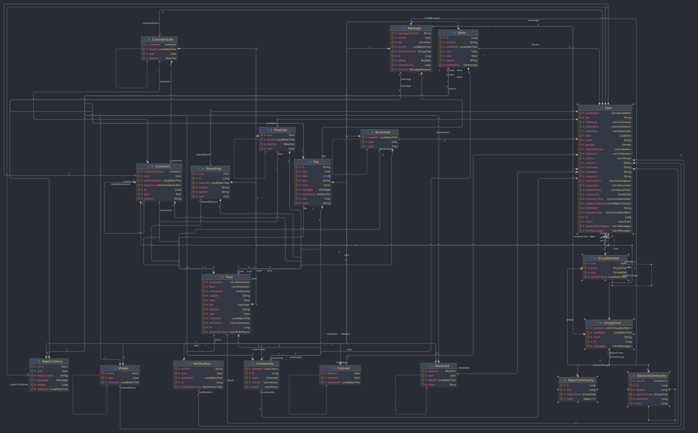

# PUs

This is a Java Spring Boot application that uses SQL for database management and Maven for dependency management.

## Class Diagram

## Getting Started

These instructions will get you a copy of the project up and running on your local machine for development and testing purposes.
Please be aware that some resources are not fully changeable, or changeable at all, and some may not have POST request method due to integrity reasons.

## New Features

### Community
Puts students from the same university in a community where they can share posts, stories, and interact with each other.
### Major Community
Makes a group chat for students from the same major and same year where they can interact with each other.
### Section Community
Makes a group chat for students who takes a course in the same section(year, semester, division) where they can interact with each other.
### Bookmark
Users can save posts.
### Storage File
Using @Lob to save a files in database.
### Group Chat
Creating groups with roles admin and members.
### Messages
Send an encrypted Messages from a user and decrypt them on the other side (p2p).
### Notification
Notify users about new interactions.
### Story
Share stories, which disappear after 24 hours and users can reply, react, and view each others stories.
### SSL
Added SSL so the user will have a more secured experience.

## Project Notes

### Important Files

- Database Setup: Please import the pus.sql file to your SQL database before running tests. This step is crucial as certain test scenarios depend on the data preset in this database.

### Testing Instructions
- Postman Usage: When testing file upload features through Postman, ensure to use a file from your local machine rather than relying on any preset files within the project. This ensures the tests run as expected.

- Authentication: For accessing restricted endpoints, you must first sign up using the /signup endpoint, then log in via the /login endpoint. Post login, use the received token as the global variable token in Postman to authenticate your requests successfully.

### Use Postman submission of Hasan

## Documentation

You can access the project's documentation from /docs/index.html, WARNING: not all of the methods is present as javaDoc errored.

## Running the tests

Go to the test file and run the tests, you may need to run the server due to security reasons.

### Prerequisites

What things you need to install the software and how to install them:

- Java
- Maven
- SQL

### Installing

A step by step series of examples that tell you how to get a development environment running:

1. Clone the repository
2. Navigate to the project directory
3. Run `mvn install` to install dependencies
4. Run `mvn spring-boot:run` to start the server

## Built With

- [Java](https://www.java.com/) - The programming language used
- [Spring Boot](https://spring.io/projects/spring-boot) - The web framework used
- [Maven](https://maven.apache.org/) - Dependency Management
- [SQL](https://www.mysql.com/) - Used for database management

## Authors

- [Hasan Zawahra](https://github.com/HasanZawahra)
- [Ehab Maali](https://github.com/71iq)
- [Nadine AbuOdeh](https://github.com/nadineabuodeh)
